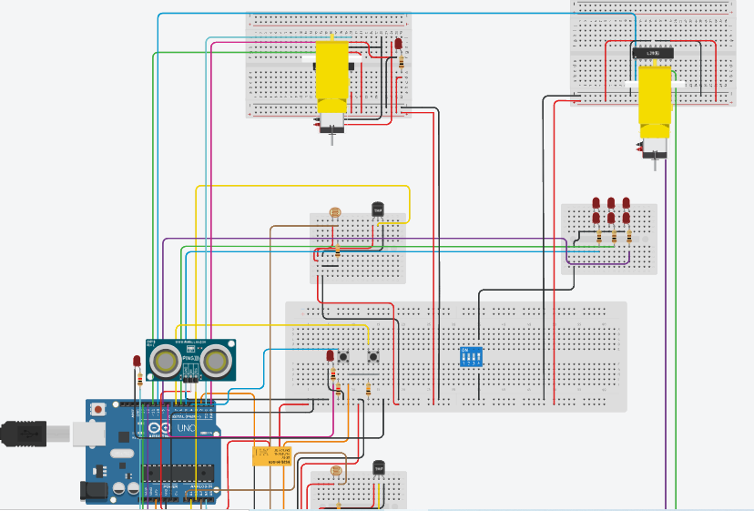

# Industrial Energy Conservation Model

The project aims to tackle energy wastage in industrial settings by implementing smart techniques to control energy usage. This includes:
- Efficient use of lighting and cooling based on outdoor conditions
- Detection of human presence
- Logging of machine output and weather conditions
- Standby Mode for automated operations of machines

## Simulation

<video>
  <source src="simulation.mp4" type="video/mp4">
</video>

## Circuit Diagram

## Components Used

|Name                                |Quantity|Component                  |
|------------------------------------|--------|---------------------------|
|U1                                  |1       | Arduino Uno R3            |
|K1                                  |1       | Relay DPDT                |
|PING1                               |1       | Ultrasonic Distance Sensor|
|S1, S2                              |2       | Pushbutton                |
|R1, R3, R11                         |3       |1 kΩ Resistor              |
|D1, D3, D4, D5, D8, D9, D10, D11, D2|9       |Red LED                    |
|U2, U3                              |2       | Temperature Sensor [TMP36]|
|R4, R5                              |2       | Photoresistor             |
|R6, R7, R8, R13                     |4       |100 Ω Resistor             |
|SW1                                 |1       | DIP Switch SPST x 4       |
|R9, R2, R10                         |3       |10 kΩ Resistor             |
|U5, U4                              |2       | H-bridge Motor Driver     |
|M5, M1                              |2       | Hobby Gearmotor           |
